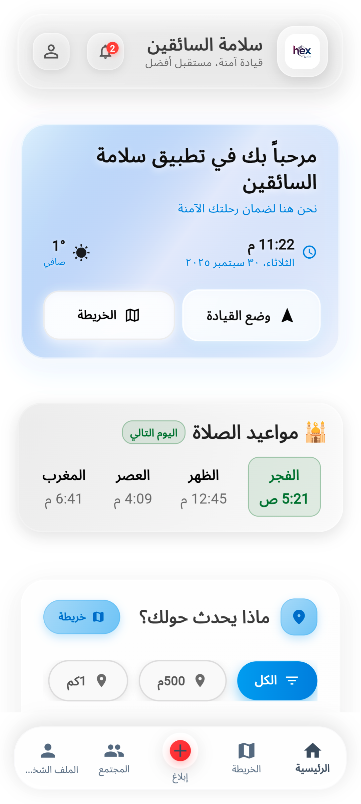
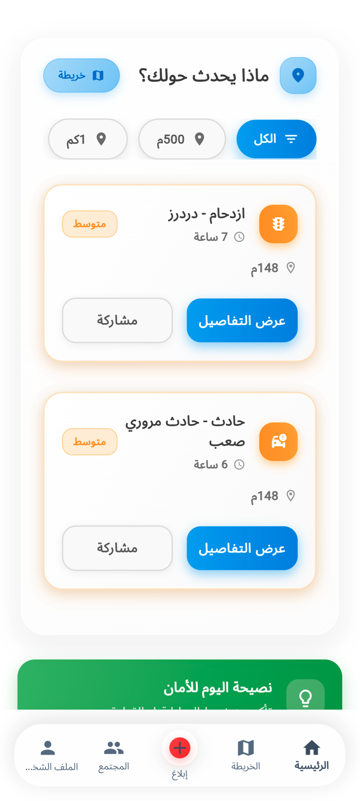
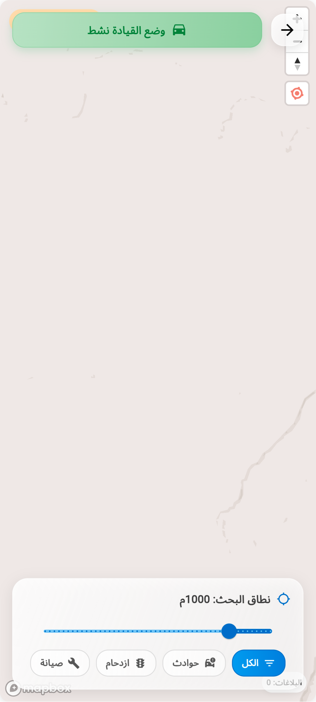
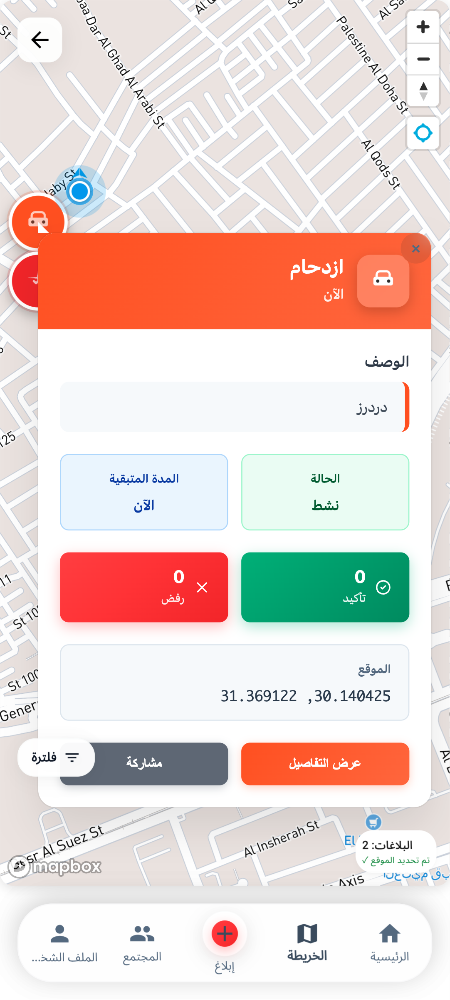
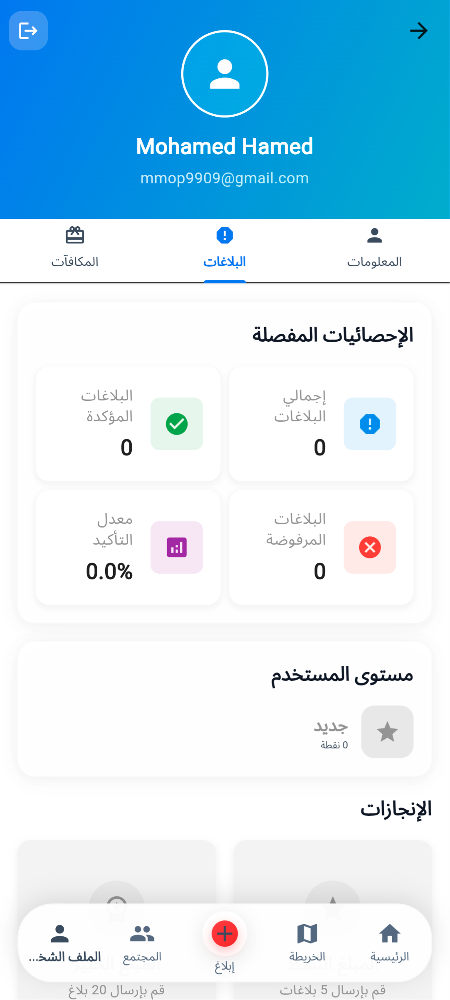

# SafeRoute - مسابقة digitopia

تطبيق ذكي لتحسين السلامة المرورية وإدارة الطرق باستخدام تقنيات الذكاء الاصطناعي والخرائط التفاعلية.

## 📱 لقطات الشاشة

<div align="center">
  <table>
    <tr>
      <td align="center">
        
        <br><b>صفحة تسجيل الدخول</b>
      </td>
      <td align="center">
        
        <br><b>الصفحة الرئيسية</b>
      </td>
      <td align="center">
        
        <br><b>الصفحة الرئيسية - عرض إضافي</b>
      </td>
    </tr>
    <tr>
      <td align="center">
        
        <br><b>قائمة الحساب</b>
      </td>
      <td align="center">
        
        <br><b>الإشعارات</b>
      </td>
      <td align="center">
        
        <br><b>وضع القيادة</b>
      </td>
    </tr>
    <tr>
      <td align="center">
        
        <br><b>صفحة الخرائط</b>
      </td>
      <td align="center">
        
        <br><b>معلومات الملف الشخصي</b>
      </td>
      <td align="center">
        
        <br><b>تقارير الملف الشخصي</b>
      </td>
    </tr>
    <tr>
      <td align="center" colspan="3">
        
        <br><b>مكافآت الملف الشخصي</b>
      </td>
    </tr>
  </table>
</div>

## ✨ الميزات الرئيسية

### 🚗 وضع القيادة الذكي
- تتبع الموقع في الوقت الفعلي
- تنبيهات صوتية للمخاطر المرورية
- إرشادات ملاحية متقدمة
- تقارير تلقائية للحوادث

### 📊 نظام التقارير والتحليلات
- إبلاغ عن الحوادث والمخاطر المرورية
- تحليل بيانات السلامة المرورية
- إحصائيات شخصية للمستخدم
- نظام نقاط الثقة والمكافآت

### 🌐 المجتمع التفاعلي
- منصة تواصل بين السائقين
- مشاركة التحديثات المرورية
- نظام التقييم والتأكيد
- دردشة مجتمعية في الوقت الفعلي

### 🔔 نظام الإشعارات الذكي
- تنبيهات فورية للمخاطر
- إشعارات مخصصة حسب الموقع
- تحديثات الطقس والطرق
- تذكيرات السلامة المرورية

### 🛡️ الأمان والخصوصية
- تشفير البيانات الشخصية
- مصادقة متعددة العوامل
- حماية الموقع الجغرافي
- إعدادات خصوصية متقدمة

## 🛠️ التقنيات المستخدمة

### Frontend
- **Flutter** - إطار عمل تطوير التطبيقات متعدد المنصات
- **Dart** - لغة البرمجة الأساسية
- **Provider** - إدارة الحالة
- **FL Chart** - الرسوم البيانية والإحصائيات

### Backend & Database
- **Firebase Core** - المنصة السحابية الأساسية
- **Cloud Firestore** - قاعدة البيانات NoSQL
- **Firebase Auth** - نظام المصادقة والتحقق
- **Firebase Storage** - تخزين الملفات والصور
- **Firebase Messaging** - الإشعارات الفورية

### Maps & Location
- **Mapbox Maps** - الخرائط التفاعلية المتقدمة
- **Mapbox Search** - البحث الجغرافي
- **Geolocator** - تحديد الموقع الجغرافي
- **Geocoding** - تحويل الإحداثيات إلى عناوين

### Authentication & Security
- **Google Sign-In** - تسجيل الدخول بحساب Google
- **Local Auth** - المصادقة البيومترية
- **Crypto** - التشفير والأمان
- **Device Info Plus** - معلومات الجهاز

### Communication & Media
- **HTTP & Dio** - طلبات الشبكة
- **Web Socket Channel** - الاتصال في الوقت الفعلي
- **Speech to Text** - التعرف على الكلام
- **Flutter TTS** - تحويل النص إلى كلام
- **Audio Players** - تشغيل الأصوات

### Utilities
- **Permission Handler** - إدارة أذونات التطبيق
- **Shared Preferences** - تخزين البيانات المحلية
- **Image Picker** - اختيار الصور
- **URL Launcher** - فتح الروابط الخارجية
- **Share Plus** - مشاركة المحتوى

## 📋 هيكل قاعدة البيانات

للاطلاع على التفاصيل الكاملة لهيكل قاعدة البيانات Firestore، يرجى مراجعة:
📄 **[وثائق قاعدة البيانات](firestore_database_schema.md)**

## 🚀 التشغيل والتطوير

### متطلبات النظام
- Flutter SDK 3.9.2 أو أحدث
- Dart SDK
- Android Studio / VS Code
- حساب Firebase مع إعداد المشروع

### خطوات التشغيل
```bash
# استنساخ المشروع
git clone https://github.com/MOHAMEDHAMED1ST/saferoute.git

# الانتقال إلى مجلد المشروع
cd saferoute

# تحميل التبعيات
flutter pub get

# تشغيل التطبيق
flutter run
```

### إعداد Firebase
1. إنشاء مشروع جديد في Firebase Console
2. إضافة تطبيق Android/iOS
3. تحميل ملفات التكوين (`google-services.json` للأندرويد، `GoogleService-Info.plist` للـ iOS)
4. تفعيل خدمات Authentication، Firestore، Storage، و Messaging

## 📱 المنصات المدعومة

- ✅ Android
- ✅ iOS  
- ✅ Web
- ✅ macOS
- ✅ Windows
- ✅ Linux

## 🤝 المساهمة

نرحب بمساهماتكم في تطوير SafeRoute! يرجى اتباع الخطوات التالية:

1. Fork المشروع
2. إنشاء فرع جديد للميزة (`git checkout -b feature/AmazingFeature`)
3. Commit التغييرات (`git commit -m 'Add some AmazingFeature'`)
4. Push إلى الفرع (`git push origin feature/AmazingFeature`)
5. فتح Pull Request

## 📄 الترخيص

هذا المشروع مرخص تحت رخصة MIT - راجع ملف [LICENSE](LICENSE) للتفاصيل.


---

<div align="center">
  <p>صُنع بـ ❤️ لتحسين السلامة المرورية</p>
  <p><strong>SafeRoute - طريقك الآمن</strong></p>
</div>